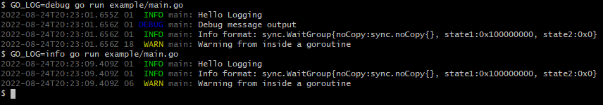

# logr

[](https://godoc.org/github.com/mrodden/logr)

Reasonable logging facilities for Go

Simple interface with Time-Thread-Condition-Component based output, with automatic colored output if supported.

## Features

 - Time: ISO 8901 format timestamps in UTC
 - Thread: Log source Goroutine identifiers
 - Condition: Log level based logging [TRACE, DEBUG, INFO, WARN, ERROR]
 - Component: Go module/package name
 - Colors: Automatically detects support for ANSI terminal colorization
 - Level Filtering: set a global level and/or per module levels


## Example

```go
import (
	"sync"

	log "github.com/mrodden/logr"
	"github.com/mrodden/logr/env_logger"
)

func main() {
	env_logger.TryInit()

	log.Info("Hello Logging")

	log.Debug("Debug message output")

	wg := sync.WaitGroup{}
	wg.Add(1)
	go func() {
		log.Warn("Warning from inside a goroutine")
		wg.Done()
	}()

	log.Infof("Info format: %#v", wg)

	wg.Wait()
}
```




## Configuration

The default logging implementation is `env_logger` which can be configured with the `GO_LOG` environment variable.

Both the global logging level filter and per module declarations can be declared. The format is similar to the Rust `env_logger` crate.

Some examples:

  - `GO_LOG=warn` - Sets the global filter level to WARN, causing any logs of WARN, ERROR, or lower to be emitted from all modules.
  - `GO_LOG=warn,github.com/mymodule/myapp=trace` - Sets the global level to WARN, and the filter for the `github.com/mymodule/myapp` to TRACE level
  - `GO_LOG=warn,main` - Sets the global level to WARN, and enables all logging for the `main` module.
